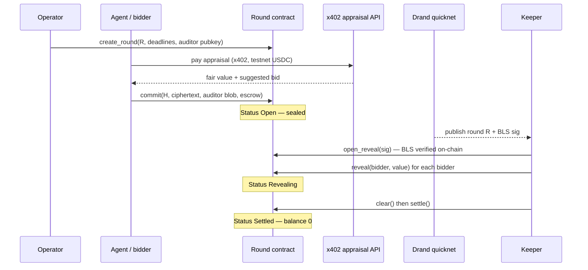

# Sub Rosa — Architecture

High-level map of the monorepo: components, trust boundaries, round lifecycle, and where each proof runs. For crypto and settlement detail see [docs/TECH_DESIGN.md](./docs/TECH_DESIGN.md).

Sub Rosa was presented as a **Hack Privacy #1** project. This repository keeps
that premium Sub Rosa interface and architecture context visible while adding a
separate **Rise In Orange Belt** evidence path for the Stellar Journey to
Mastery submission.

## Current repository scope

This repository has two related but distinct surfaces:

| Surface | Purpose | Primary files |
| --- | --- | --- |
| **Sub Rosa premium demo** | Full sealed allocation concept: Drand-gated commit/reveal, agents, keeper, x402, settlement evidence, and architecture narrative | `apps/web`, `packages/*`, `services/*`, `ARCHITECTURE.md` |
| **Rise In Orange mini dApp** | Submission-specific educational flow: Freighter Testnet wallet, XLM payment, and a compact Soroban round/commit contract | `contracts/rise-in-round`, `apps/web/src/components/RiseInOrangePanel.tsx`, `apps/web/src/lib/risein-*` |

The Orange panel intentionally calls `contracts/rise-in-round`, not the full
production Sub Rosa Round contract. This keeps the Rise In evidence small,
reviewable, and independent while preserving the richer Sub Rosa UI.

---

## Problem and primitive

Sub Rosa is a **sealed commit–reveal coordination primitive** on Stellar Soroban. Participants commit now; a public Drand round **R** forces simultaneous opening later; the contract clears and settles without operator discretion.

| Phase | Who acts | What happens |
| --- | --- | --- |
| **Commit** | Bidder or agent session key | Lock escrow, post commitment `H`, store tlock ciphertext + auditor blob |
| **Wait R** | — | Bids undecryptable; only `H` and escrow are public |
| **Open reveal** | Anyone (keeper) | Submit Drand round-R BLS signature; verified **on-chain** |
| **Reveal** | Anyone (keeper) | Decrypt every seal; contract checks `H` binding |
| **Clear / settle** | Anyone (keeper) | Deterministic winner; SAC transfers; contract balance → 0 |

The operator does **not** need keys to open bids. After R, values are public; identities stay auditor-encrypted until opened with the round auditor key.

---

## System diagram

```
                         ┌─────────────────────────────────────────┐
                         │           Stellar Soroban               │
                         │  ┌───────────────────────────────────┐  │
  sealBid + commit ─────►│  │  contracts/round (Round WASM)     │  │
  (session key)          │  │  · create_round / commit / reveal │  │
                         │  │  · open_reveal (BLS verify)       │  │
                         │  │  · clear / settle (SAC)         │  │
                         │  └───────────────────────────────────┘  │
                         └─────────────────────────────────────────┘
        ▲                              ▲
        │ packages/tlock               │ packages/sdk (SubRosaClient)
        │ sealBid / openBid            │ bindings + RPC (+ optional OZ submitter)
        │                              │
 ┌──────┴──────┐                ┌──────┴──────┐
 │ services/   │   HTTP 402     │ services/   │
 │ agent       │───────────────►│ appraisal-  │
 │ mandate+caps│   x402 USDC    │ api         │
 └─────────────┘                └─────────────┘
        │
        │  services/keeper — permissionless keepRound / closeRound / watch
        ▼
 ┌─────────────┐     embedded trace      ┌─────────────┐
 │ Drand       │                         │ apps/web    │
 │ quicknet    │                         │ jury demo   │
 └─────────────┘                         └─────────────┘
```

---

## Round lifecycle



---

## Monorepo layout

| Path | Layer | Responsibility |
| --- | --- | --- |
| `contracts/round/` | On-chain | Soroban Round: storage tiers, BLS host verify, SAC settle |
| `contracts/rise-in-round/` | On-chain | Rise In Orange mini contract: `create_round`, `submit_commit`, `get_round`, `get_commit` |
| `packages/round-bindings/` | Generated | TypeScript bindings from WASM |
| `packages/tlock/` | Crypto (off-chain) | tlock seal/open, auditor identity blob |
| `packages/sdk/` | Client | `SubRosaClient`, encoding, optional OZ Relayer Channels submitter |
| `services/drand-tools/` | Harness | Live quicknet ↔ on-chain BLS constant validation |
| `services/keeper/` | Ops | Permissionless reveal/clear/settle; `keeper:watch` daemon |
| `services/appraisal-api/` | Service | x402-gated appraisal (SEP-41 USDC on testnet) |
| `services/agent/` | Agent support | Session mandate, cap checks, x402 + commit flow |
| `apps/web/` | UI | Premium Sub Rosa demo plus Rise In Orange evidence panel |

Package manager: **pnpm** workspace. Contract build: **Stellar CLI** + Rust (`wasm32v1-none`).

---

## Trust boundaries

| Component | Trusted for | Not trusted for |
| --- | --- | --- |
| **Round contract** | Escrow, `H` binding, BLS gate, clearing rule | Off-chain mandate caps |
| **Drand quicknet** | Unbiased future randomness / round-R sig | Liveness (keeper can void after grace) |
| **Operator** | Creating rounds, receiving winner payment | Reading sealed bids before R |
| **Keeper** | Liveness (open/reveal/clear) | Secrecy after R (all bids must reveal) |
| **Agent software** | Enforcing mandate caps off-chain | Honesty if compromised or buggy |
| **Auditor** | Identity disclosure when given secret | Must not learn bid values before R |
| **Appraisal API** | Valuation after x402 pay | Unbiased pricing (economic trust) |

Full adversary analysis: [docs/THREAT_MODEL.md](./docs/THREAT_MODEL.md).

---

## Two payment rails (same SEP-41 asset, different jobs)

On **testnet**, both appraisal and prize settlement use **USDC SAC**. They are intentionally separate:

| Rail | Path | Used for |
| --- | --- | --- |
| **x402** | Agent → appraisal server via HTTP 402 + facilitator | Appraisal micro-payment only |
| **SAC `settle()`** | Round contract escrow → operator + refunds | Winner prize — **not** x402 |

**Mainnet smoke** uses **native XLM SAC** (1 / 5 XLM), not USDC — see [docs/LIMITATIONS.md](./docs/LIMITATIONS.md).

---

## Agent authorization model

```
Principal (G-address)
    │ signs mandate JSON (maxBid, maxEscrow, maxAppraisalSpend, contract, round)
    ▼
Session Ed25519 key  ──► x402 pay + Soroban commit (never principal on-chain)
```

- **Off-chain:** agent verifies mandate signature and caps before any payment or commit.
- **On-chain:** `valid = value > 0 && value ≤ escrow` at reveal.

Production mapping (Passkey / Smart Account Kit / OZ Relayer): [docs/ECOSYSTEM.md](./docs/ECOSYSTEM.md). Not on the critical path for this submission.

---

## Planned Stellar Wallets Kit integration

This section describes the planned **Stellar Wallets Kit** integration for the
SCF Integration Track. It does not describe a completed integration and does not
replace the existing proof paths.

### Current state

- The live end-user flow in `apps/web` connects directly to Freighter through
  `@stellar/freighter-api`.
- `apps/web/src/lib/chain.ts` adapts Freighter transaction and authorization
  signing to the generated `RoundContract` client.
- Agent and keeper proofs continue to use session keys and direct Soroban RPC;
  they do not depend on a browser wallet.
- The embedded jury trace and existing testnet/mainnet proof artifacts remain
  unchanged.

### Target state

Stellar Wallets Kit will become the browser-wallet connection and signing layer
for the end-user application. The contract, generated bindings, tlock package,
keeper, and settlement rules remain wallet-agnostic.

```text
Supported Stellar wallet
        │
        ▼
Stellar Wallets Kit
  connect / select / sign
        │
        ▼
apps/web wallet adapter
        │
        ▼
RoundContract client ──► Soroban RPC ──► contracts/round
```

The adapter will expose the signer interface already consumed by
`RoundContract`: the selected public address, transaction signing, and Soroban
authorization-entry signing. This keeps wallet-specific behavior outside the
protocol and SDK layers.

### End-user transaction flows

| Flow | Wallets Kit role | Existing protocol behavior retained |
| --- | --- | --- |
| Connect | Discover/select a supported wallet and expose its active Stellar address | No contract call |
| Create round | Sign the operator transaction | Contract stores deadlines, Drand round, clearing rule, and auditor key |
| Commit | Sign the bidder transaction after the browser seals the value with `packages/tlock` | Contract locks SAC escrow and stores commitment/ciphertext |
| Reveal / clear / settle | Allow an authorized user to submit permissionless lifecycle calls when desired | Keeper can still perform these calls without a browser wallet |
| Read status | Provide the active address for user-specific UI state | Reads continue through Soroban RPC |

The initial target is standardized multi-wallet support for wallets exposed by
Stellar Wallets Kit, including Freighter, xBull, Albedo, and Lobstr where their
supported signing capabilities satisfy the required Soroban flows. Unsupported
wallet/capability combinations will be surfaced explicitly rather than falling
back to hidden keys.

### Migration and verification plan

1. Add a Wallets Kit adapter beside the current Freighter adapter.
2. Verify connection, network selection, transaction signing, and Soroban
   authorization-entry signing against the existing `RoundContract` interface.
3. Move the end-user UI to the Wallets Kit adapter after parity is proven.
4. Retain direct RPC/session-key paths for agents, keepers, automated tests, and
   operational recovery.
5. Test round creation, sealed commit, reveal readiness, settlement, rejection,
   reconnect, and wrong-network states on Stellar testnet.
6. Publish the supported-wallet matrix and test evidence before enabling the
   adapter in the production mainnet web app.

This integration changes how end users authorize transactions; it does not
change the sealed-round state machine, Drand trust model, or SAC settlement
logic.

---

## Rise In Orange evidence path

The `Orange` tab in the web UI provides the submission-specific path:

1. Detect and connect Freighter.
2. Enforce Stellar Testnet before each signature.
3. Load native XLM balance from Horizon testnet.
4. Build a native XLM payment in the browser and ask Freighter to sign it.
5. Call the deployed `contracts/rise-in-round` Soroban contract through
   Soroban RPC simulation, preparation, submission, and polling.
6. Create a round with `create_round`.
7. Hash a private sample allocation locally with SHA-256.
8. Store the 32-byte commitment with `submit_commit`.
9. Refresh `get_round` and show title, owner, timestamp, and commitment count.

Current Rise In Testnet contract:

```text
CAEIOZEPTKBDERVUJVTVOZEXPS2PPUHODOGEBUXCTUKD6KUDM3Z4MJ2I
```

The deploy transaction is:

```text
28d683d107e928d0ab7850e1622135995188bf865f655ba874bd12605faf9965
```

## Demo and proof artifacts

| Network | Contract | UI / trace |
| --- | --- | --- |
| **Testnet** | `CAPTODBCDEVIK23ALBJBS2TXRTIK47ZA5MBTHYF4XLHG2BK7JPYUCU2Y` | `apps/web/src/demo/demo-trace.generated.ts` |
| **Rise In Testnet** | `CAEIOZEPTKBDERVUJVTVOZEXPS2PPUHODOGEBUXCTUKD6KUDM3Z4MJ2I` | `Orange` tab in `apps/web` |
| **Mainnet** | `CA7KSDEYJEPGZEB2ZROTLUWKQQ6GIRIQNGG6Z745MZ34QHP4UJPWODEX` | Mainnet proof card in UI; `pnpm mainnet:verify` |

Canonical end-to-end testnet run (agents → x402 → commits → keeper → settle → 0):

```bash
pnpm agents:e2e
```

Other proofs: `pnpm lifecycle:e2e`, `pnpm appraisal:e2e`, `pnpm mainnet:verify`. See README **Proof at a glance**.

The Sub Rosa evidence mode is **read-mostly**: embedded trace + optional live RPC
poll. The `Live round` and `Orange` tabs include Freighter wallet actions for
interactive testnet evidence.

---

## Storage model (on-chain)

| Tier | Contents | Lifetime |
| --- | --- | --- |
| **Instance** | Drand pubkey, DST, genesis, period, token SAC | Contract lifetime |
| **Persistent** | Round record, per-bidder escrow / revealed value | Until settle or void |
| **Temporary** | Ciphertext + auditor blob | Expires after reveal window |

---

## Related documentation

| Document | Focus |
| --- | --- |
| [docs/TECH_DESIGN.md](./docs/TECH_DESIGN.md) | Cryptography, storage, settlement rails, relayer hook |
| [docs/THREAT_MODEL.md](./docs/THREAT_MODEL.md) | Adversaries and mitigations |
| [docs/DEPLOY.md](./docs/DEPLOY.md) | UI build vs runtime secrets |
| [docs/DEMO_SCRIPT.md](./docs/DEMO_SCRIPT.md) | 5-minute jury walkthrough |
| [docs/TRACK_ANSWERS.md](./docs/TRACK_ANSWERS.md) | Hackathon track mapping |
| [docs/LIMITATIONS.md](./docs/LIMITATIONS.md) | Honest scope boundaries |
| [docs/ECOSYSTEM.md](./docs/ECOSYSTEM.md) | Passkey, Smart Account Kit, OZ Relayer |
